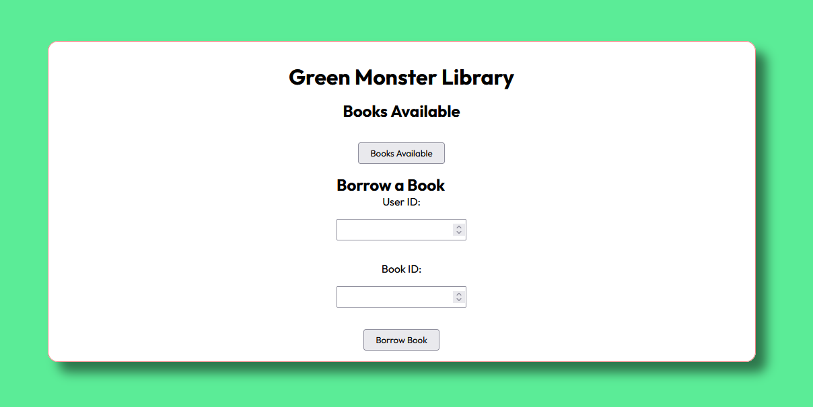

# 📚Library Management System

This is a basic Library Management System project. It includes a database setup and a Node.js backend to connect to the database and serve an HTML frontend.



## ✨Features

* Connects to a MySQL database.
* Serves an HTML frontend.
* Provides API endpoints to:
    * Get available books.
    * Borrow a book.

## Technologies Used

* Node.js
* Express.js
* MySQL
* mysql2
* dotenv

## Project Structure
```bash
your-project-directory/
 ├── index.html          # Frontend HTML
 ├── index.js            # Backend Node.js server
 ├── database/
 │   └── schema.sql    # MySQL database schema
 ├── .env                # Environment variables (for database credentials)
 ├── node_modules/       # Node.js dependencies
 ├── package.json          # Project configuration
 ├── package-lock.json     #  Dependency Management
 └── README.md           # Project documentation
```
## Setup Instructions

***Ensure You have node.js installed***

1.  **Clone the repository:**

    ```bash
    git clone https://github.com/charlesricha/Library-management-WK-8-Database-Project.git
    cd Library-management-WK-8-Database-Project
    ```

2.  **Install dependencies:**

    ```bash
    npm install express, sql2, dotenv
    ```

3.  **Set up the database:**

    * Create a MySQL database.
    * Run the SQL queries in `database/schema.sql` to create the necessary tables.

4.  **Configure environment variables:**

    * Create a `.env` file in the project root.
    * Add your MySQL database credentials to the `.env` file:

        ```bash
        DB_HOST=your_host
        DB_USER=your_mysql_user
        DB_PASSWORD=your_mysql_password
        DB_NAME=your_database_name
        PORT=3000
        ```

    * Replace the placeholder values with your actual database credentials.
    * **Important:** Ensure that the `.env` file is added to your `.gitignore` file.

5.  **Start the server:**

    ```bash
    npm run start
    ```
    or
    ```bash
    node index.js
    ```

6.  **View the application:**

    * Open your web browser and go to `http://localhost:3000`.

##  Important Notes on Security
* **Database Credentials:** The application uses a `.env` file to store sensitive information, such as database credentials.  This file is not included in version control.
* **SQL Injection:** The application uses parameterized queries to help prevent SQL injection attacks.

##  Future Improvements
* Implement user authentication.
* Add more features to manage books and users.
* Create a more user-friendly frontend.
